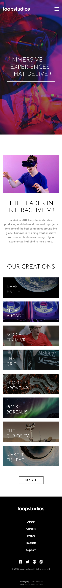
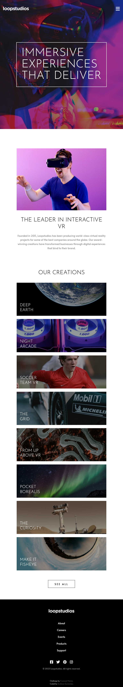
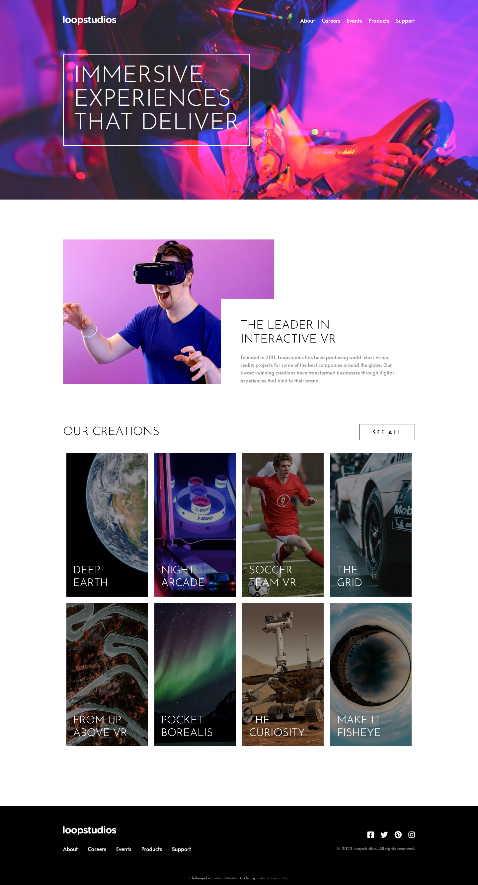

# Loopstudios landing page - Web Design Project - Frontend Mentor

[](https://loopstudios-lake.vercel.app/)

[](https://developer.mozilla.org/pt-BR/docs/Web/HTML)
[](https://developer.mozilla.org/pt-BR/docs/Web/CSS)
[](https://developer.mozilla.org/pt-BR/docs/Web/JavaScript)
[](https://sass-lang.com/)

---

**Disponível em | Avaliable in: Português - BR | English**

Esta é uma landing page para a página fictícia Loopstudios, mais um desafio proposto pela plataforma [Frontend Mentor](https://www.frontendmentor.io/challenges/loopstudios-landing-page-N88J5Onjw). Construída para fins acadêmicos, foram aplicadas as tecnologias e boas práticas do web design.

Neste projeto, os usuários são capazes de:

- Visualizar o layout ideal para o site, dependendo do tamanho da tela do dispositivo.
- Ver os estados de foco para todos os elementos interativos na página.

*This is a landing page for the fictitious Loopstudios page, another challenge proposed by the [Frontend Mentor](https://www.frontendmentor.io/challenges/loopstudios-landing-page-N88J5Onjw) platform. Built for academic purposes, web design technologies and good practices were applied.*

*In this project users are able to:*

- *View the optimal layout for the site depending on their device's screen size.*
- *See hover states for all interactive elements on the page.*

## Status do projeto | Project status

Projeto finalizado, sendo aberto a propostas de melhorias ou correções.

*Finalized project, being open to proposals for improvements or corrections.*

## Layout

Construído a partir do método *mobile-first*, o projeto é responsivo, ou seja, é adaptável aos mais variados tamanhos e resoluções de telas, conforme demonstrado a seguir.

*Built from the mobile-first method, the project is responsive, that is, it is adaptable to the most varied sizes and screen resolutions, as shown below.*



Captura de tela em 375px | Screenshot in 375px

---



Captura de tela em 768px | Screenshot in 768px

---



Captura de tela em 1440px | Screenshot in 1440px

---


Você também pode conferir a página acessando este link: [https://loopstudios-lake.vercel.app/](https://loopstudios-lake.vercel.app/).

**Observação:** Por se tratar de um projeto para fins acadêmicos, os links contidos na página não funcionarão, exceto os dois últimos localizados no rodapé.

*You can also check the page by accessing this link: [https://loopstudios-lake.vercel.app/](https://loopstudios-lake.vercel.app/).*

_**Note:** As this is a project for academic purposes, the links on the page will not work, except for the last two located at the footer._

## Tecnologias utilizadas | Technologies used

Foram utilizadas as seguintes tecnologias para a construção desta página:

*The following technologies were used to build this page:*

- [HTML 5](https://developer.mozilla.org/pt-BR/docs/Web/HTML)
- [CSS 3](https://developer.mozilla.org/pt-BR/docs/Web/CSS)
- [JavaScript](https://developer.mozilla.org/pt-BR/docs/Web/JavaScript)
- [Sass](https://sass-lang.com/)

Vale lembrar que foram aplicados o uso de tags semânticas ao HTML, para tornar a página com acessibilidade facilitada e seguir as boas práticas do desenvolvimento web.

O uso do preprocessador CSS (nesse caso o Sass) torna mais produtiva a aplicação das folhas de estilo, o que possibilita a manutenibilidade posteriormente.

*It is worth remembering that the use of semantic tags was applied to the HTML, to make the page easier to access and follow the good practices of web development.*

*Using the CSS preprocessor (in this case Sass) makes the application of stylesheets more productive, which enables later maintainability.*

## Como instalar | How to install

Para baixar e instalar o projeto no seu computador, siga os seguintes passos:

- Instale o editor [VS Code](https://code.visualstudio.com/) (recomendo fortemente, mas se há outro editor do seu gosto, não tem problema) e abra o projeto nele.
- Se você está usando VS Code, instale a extensão "[Live Sass Compiler](https://marketplace.visualstudio.com/items?itemName=ritwickdey.live-sass)", ela que vai converter seu Sass em CSS. Após instalado:
    - Clique no ícone de engrenagem, depois em "Configurações de extensão" e depois em "settins.json";
    - Em ```settings.json``` acrescente os seguintes parâmetros:
    ```json
    "liveSassCompile.settings.formats":[ 
        {
            "format": "expanded",
            "extensionName": ".css",
            "savePath": "assets/styles/css"
        },
        {
            "format": "compressed",
            "extensionName": ".min.css",
            "savePath": "assets/styles/css"
        },
    ]
    ```
    - Depois, na parte inferior do editor, clique em "Watch Sass".
- Se você não está usando VS Code, você precisa instalar o NodeJS para usar o Sass.
    - Depois de instalar o NodeJS, abra o prompt de comando e navegue até o diretório do projeto.
    ```
    cd [caminho do projeto]
    ```
    - Instale o Sass com o ```npm```.
    ```
    npm install -g sass
    ```
    - Ative o compilador com o seguinte comando: (Para criar a versão minificada do CSS utilize a flag ```--style=compressed```)
    ```
    sass assets/styles/scss/style.scss:assets/styles/css/style.css --watch
    ```
- Recomendo também instalar a extensão "[Live server](https://marketplace.visualstudio.com/items?itemName=ritwickdey.LiveServer)". Caso não queira, abra o arquivo ```index.html``` no navegador.
- Divirta-se!

*To download and install the project on your computer, follow these steps:*

- *Install the [VS Code](https://code.visualstudio.com/) editor (I highly recommend it, but if there's another editor you like, no problem) and open the project in it.*
- *If you are using VS Code, install the "[Live Sass Compiler](https://marketplace.visualstudio.com/items?itemName=ritwickdey.live-sass)" extension, which will convert your Sass into CSS. After installed:*
    - *Click on the gear icon, then on "Extension settings" and then on "settins.json";*
    - *In ```settings.json``` add the following parameters:*
    ```json
    "liveSassCompile.settings.formats":[ 
        {
            "format": "expanded",
            "extensionName": ".css",
            "savePath": "assets/styles/css"
        },
        {
            "format": "compressed",
            "extensionName": ".min.css",
            "savePath": "assets/styles/css"
        },
    ]
    ```
    - *Then, at the bottom of the editor, click on "Watch Sass".*
- *If you are not using VS Code, you need to install NodeJS to use Sass.*
    - *After installing NodeJS, open the command prompt and navigate to your project directory.*
    ```
    cd [project path]
    ```
    - *Install Sass with ```npm```.*
    ```
    npm install -g sass
    ```
    - *Activate the compiler with the following command: (To create the minified version of the CSS use the flag ```--style=compressed```)*
    ```
    sass assets/styles/scss/style.scss:assets/styles/css/style.css --watch
    ```

- *I also recommend installing the "[Live server](https://marketplace.visualstudio.com/items?itemName=ritwickdey.LiveServer)" extension. If not, open the ```index.html``` file in your browser.*
- *Enjoy it!*

## O que eu aprendi | What I learned

Alguns recursos de rolagem de página foram utilizados nesse projeto, me possibilitando explorar as propriedades do objeto "window" do JavaScript.

Ao utilizar o evento "scroll" para o objeto "window", é possível controlar comportamentos do DOM e dar um aspecto mais vivo para a página. No meu caso, utilizei a mudança de estilo para o "header", que é fixo, adicionando uma cor de fundo e alterando sua altura. Também acrescentei um botão na base da página para que, ao ser clicada, a página seja rolada até o início.

Utilizando essa propriedade em conjunto com o atributo ```transition``` do CSS, seu site não fica monótono.

```js
window.onscroll = () => {
    // Codifique e seja feliz!
}

// OU

window.addEventListener("click", () => {
    // Codifique mais e seja feliz!
})
```

```css
/* Exemplo de aplicação do "transition" */
.seletor {
    transition: all 0.5s ease;
}
```

*Some page scrolling features were used in this project, allowing me to explore the properties of the JavaScript "window" object.*

*By using the "scroll" event for the "window" object, it is possible to control DOM behaviors and give a more lively aspect to the page. In my case, I used the style change for the "header", which is fixed, adding a background color and changing its height. I also added a button at the bottom of the page so that, when clicked, the page is scrolled to the beginning.*

*Using this property in conjunction with the CSS ```transition``` attribute, your site does not look monotonous.*

```js
window.onscroll = () => {
    // Code and be happy!
}

// OR

window.addEventListener("click", () => {
    // Code more and be happy!
})
```

```css
/* Example application of "transition" */
.selector {
    transition: all 0.5s ease;
}
```

## Autor | Author

Feito com :heart: por este cara sonhador:

*Made with :heart: by this dreamy guy:*
# Loopstudios landing page web design project - by Frontend Mentor

[](https://developer.mozilla.org/pt-BR/docs/Web/HTML)
[](https://developer.mozilla.org/pt-BR/docs/Web/CSS)
[](https://developer.mozilla.org/pt-BR/docs/Web/JavaScript)
[](https://sass-lang.com/)

|  **Giulliano Guimarães** |
| ---------------------------------------------------------------------------------------------------------------------------------- |
|[](https://github.com/giullianoth) [](https://www.instagram.com/giullianoth/) [](https://www.linkedin.com/in/giullianoth/) [](mailto:llthguimaraes@gmail.com) |
---